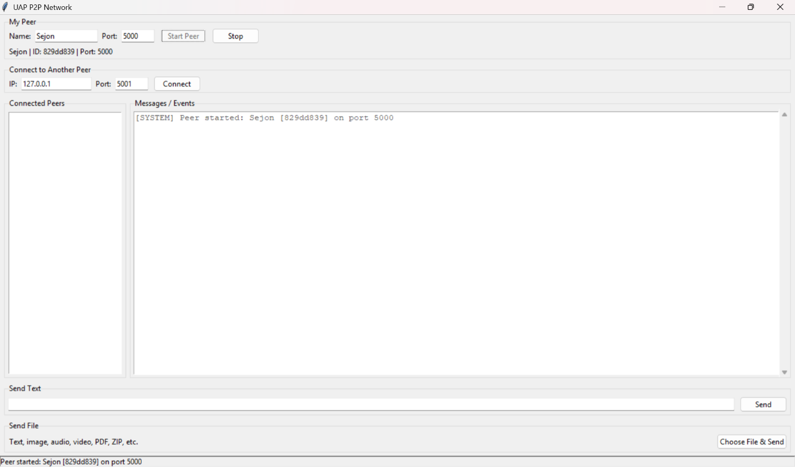
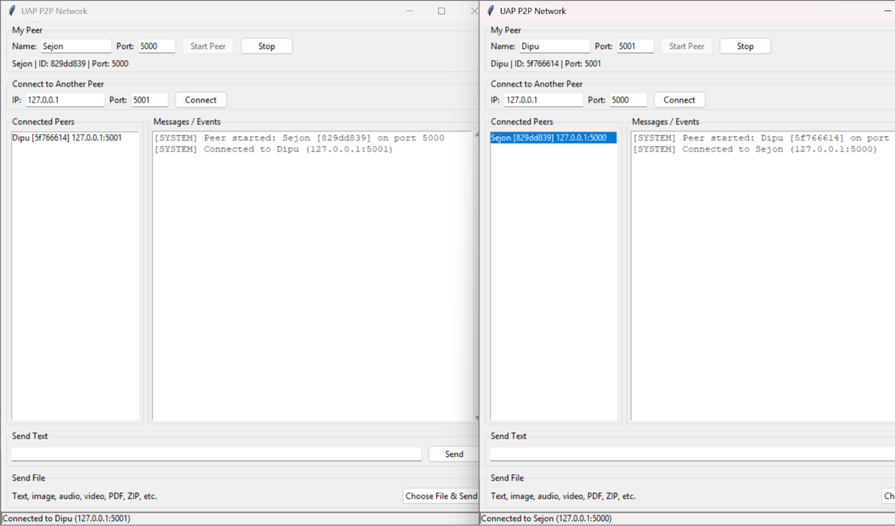
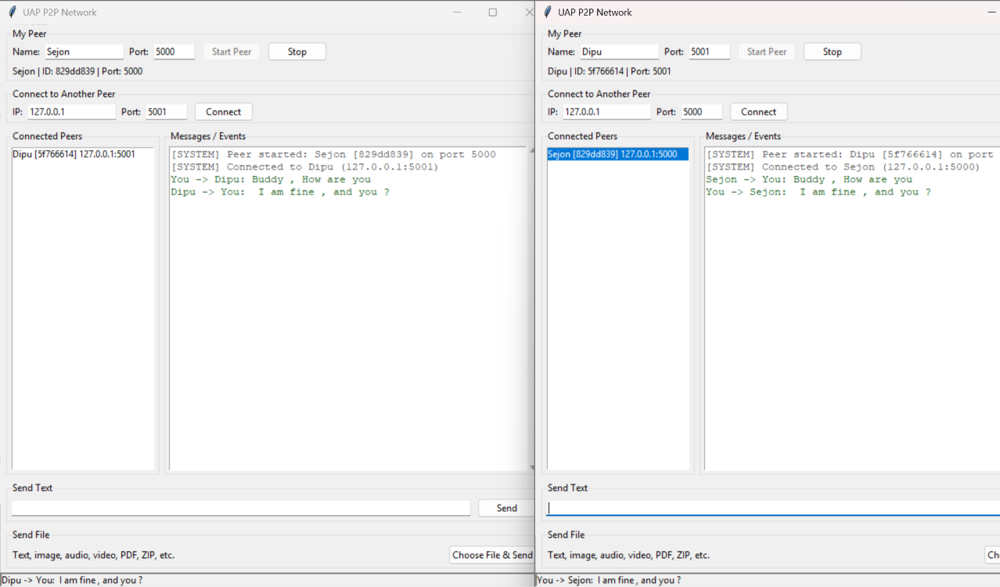
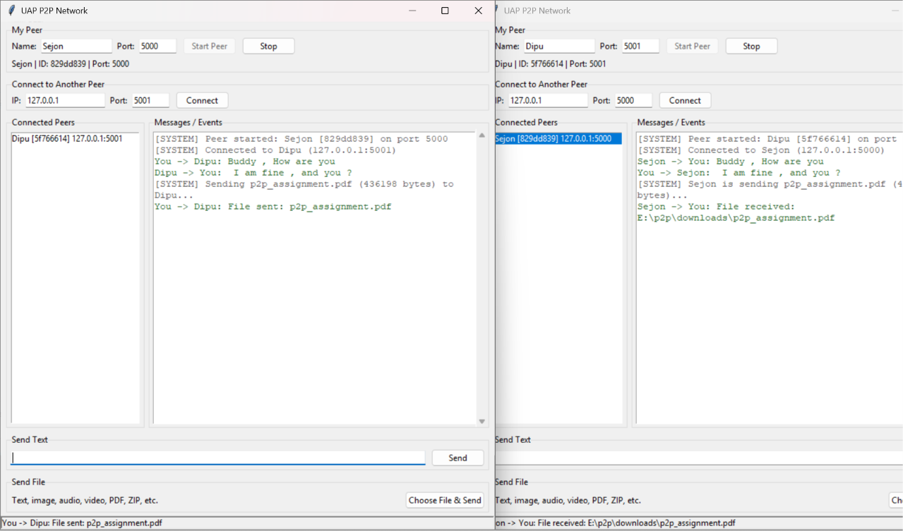
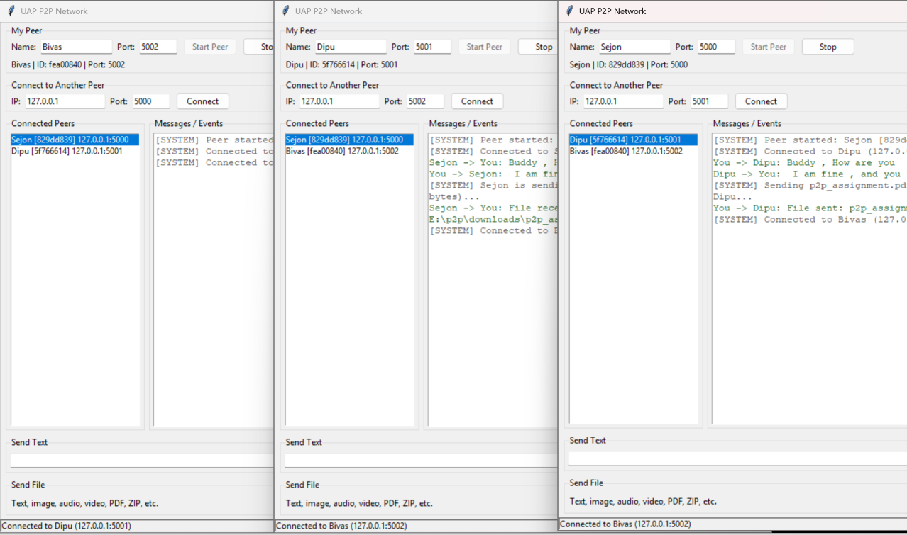

# 🌐 UAP P2P Network

### Peer-to-Peer Communication and File Sharing System

A lightweight **Peer-to-Peer (P2P) communication and file-sharing application** developed in Python for the **CSE 433 — Blockchain & Distributed Security Lab** at the University of Asia Pacific.

The system allows multiple independent peers to communicate and exchange files directly over TCP connections without relying on a centralized server. Each running instance operates simultaneously as a **TCP server and TCP client**, enabling decentralized peer-to-peer communication.

---

## 📖 Overview

Traditional client-server applications depend on a central server to coordinate communication between users. This project demonstrates an alternative approach using a **peer-to-peer architecture**, where participating nodes communicate directly with one another.

Each peer:

- 🖥️ Runs its own TCP server to accept incoming connections.
- 🔌 Acts as a TCP client to connect to other peers.
- 🆔 Identifies itself using a unique peer ID, name, and listening port.
- 💬 Exchanges text messages directly with connected peers.
- 📁 Transfers files directly between peers.
- 🌐 Can maintain multiple peer connections simultaneously.

**No central server is required for communication.**

---

## ✨ Key Features

- 🔗 **Peer-to-Peer Architecture** — Direct communication between participating nodes.
- 🌐 **TCP Networking** — Reliable communication using Python TCP sockets.
- 🔄 **Dual Server/Client Peer** — Every peer can both accept and initiate connections.
- 🤝 **Peer Handshake** — HELLO / HELLO_ACK mechanism for peer identification.
- 💬 **Text Messaging** — Send messages directly to connected peers.
- 📁 **Binary File Transfer** — Transfer files of different formats without format-specific handling.
- 👥 **Multiple Peer Connections** — Connect to and communicate with multiple peers.
- 🧵 **Multithreaded Networking** — Network operations run independently from the GUI.
- 📦 **Message Framing** — Length-prefixed JSON messages prevent TCP stream-boundary issues.
- 💾 **Automatic File Storage** — Received files are saved in the `downloads/` directory.
- 📄 **Duplicate File Handling** — Existing filenames are preserved by generating a new filename.
- 🖼️ **Tkinter GUI** — Simple graphical interface for managing peers and transfers.
- ⚠️ **Error Handling** — Common connection and file-transfer errors are handled without terminating the application.

---

## 🏗️ System Architecture

```text
                         ┌──────────────────────┐
                         │      Tkinter GUI     │
                         └──────────┬───────────┘
                                    │
                                    ▼
                         ┌──────────────────────┐
                         │       P2P Node       │
                         │                      │
                         │  TCP Server          │
                         │  TCP Client          │
                         │  Peer Management     │
                         └──────────┬───────────┘
                                    │
                                    ▼
                         ┌──────────────────────┐
                         │     TCP Socket       │
                         └──────────┬───────────┘
                                    │
                 ┌──────────────────┼──────────────────┐
                 │                  │                  │
                 ▼                  ▼                  ▼
            ┌─────────┐        ┌─────────┐        ┌─────────┐
            │ Peer A  │        │ Peer B  │        │ Peer C  │
            └─────────┘        └─────────┘        └─────────┘
```

Each peer consists of:

```text
TCP Server + TCP Client + Peer Management + GUI
```

This allows every running instance to participate as an independent node in the network.

---

## 🔄 Communication Model

The application uses direct TCP connections between peers.

For example:

```text
             TCP Connection
        ┌─────────────────────┐
        │                     │
        ▼                     │
   ┌─────────┐           ┌─────────┐
   │ Peer A  │◄─────────►│ Peer B  │
   │  :5000  │           │  :5001  │
   └─────────┘           └─────────┘
```

For multiple peers:

```text
                    ┌─────────┐
                    │ Peer A  │
                    │  :5000  │
                    └────┬────┘
                         │
                ┌────────┴────────┐
                │                 │
                ▼                 ▼
          ┌─────────┐       ┌─────────┐
          │ Peer B  │       │ Peer C  │
          │  :5001  │       │  :5002  │
          └─────────┘       └─────────┘
```

There is no dedicated central communication server.

---

## 🛠️ Technology Stack

| Component | Technology |
|---|---|
| 🐍 Programming Language | Python 3.9+ |
| 🖥️ GUI | Tkinter |
| 🌐 Networking | TCP/IP Sockets |
| 📦 Data Format | JSON |
| 🧵 Concurrency | Python `threading` |
| 📁 File Handling | Python File I/O |
| 📡 Message Protocol | Custom Length-Prefixed Protocol |
| 📚 External Dependencies | None |

The project uses Python's standard library and does not require third-party packages.

---

## 📂 Project Structure

```text
UAP-P2P-Network/
│
├── main.py
├── p2p_node.py
├── protocol.py
├── requirements.txt
├── README.md
│
├── downloads/
│
└── project-screenshots/
    ├── ss1-p2p.png
    ├── ss2.png
    ├── ss3.png
    ├── ss4.png
    └── ss5.png
```

### 📌 Module Responsibilities

| File / Directory | Responsibility |
|---|---|
| `main.py` | Tkinter-based graphical user interface |
| `p2p_node.py` | TCP server/client, peer connections, handshake, messaging, and file transfer |
| `protocol.py` | Message framing, JSON message builders, and file-transfer handling |
| `downloads/` | Storage location for received files |
| `project-screenshots/` | Screenshots demonstrating the application |
| `requirements.txt` | Dependency information |
| `README.md` | Project documentation |

---

# 🚀 Installation and Setup

## 📋 Prerequisites

Before running the project, make sure you have:

- 🐍 Python **3.9 or later**
- 🖥️ Tkinter
- 💻 A Python-compatible IDE or terminal
- 🌐 Network access if testing between different computers

### 🔎 Verify Python

```bash
python --version
```

Example:

```text
Python 3.11.9
```

---

## 🖼️ Verify Tkinter

Run:

```bash
python -m tkinter
```

If a Tkinter test window appears, the GUI environment is configured correctly.

### 🐧 Linux

On Ubuntu/Debian-based systems, Tkinter can be installed using:

```bash
sudo apt install python3-tk
```

---

## 📦 Dependencies

No third-party Python packages are required.

The application uses standard Python modules such as:

```text
socket
threading
json
os
uuid
tkinter
```

Therefore, there is no additional package installation step required.

---

# ▶️ Running the Application

Start the application using:

```bash
python main.py
```

The GUI provides controls for:

- 👤 Peer name
- 🔢 Listening port
- 🌐 Remote IP address
- 🔢 Remote port
- ▶️ Starting the peer
- 🔗 Connecting to another peer
- 👥 Selecting a connected peer
- 💬 Sending text messages
- 📁 Sending files

---

# 🔗 Connecting Two Peers

## 🅰️ Peer A

Start the first application instance.

Example:

```text
Peer Name: Alice
Port: 5000
```

Click:

**Start Peer**

---

## 🅱️ Peer B

Start a second application instance.

Example:

```text
Peer Name: Bob
Port: 5001
```

Click:

**Start Peer**

Then enter Peer A's connection information:

```text
Remote IP:   127.0.0.1
Remote Port: 5000
```

Click:

**Connect**

After the connection is established, the peers perform the handshake and Peer A appears in Peer B's connected-peer list.

---

# 🧪 Testing on the Same Computer

Multiple instances can be executed on the same computer as long as each peer uses a different listening port.

Example:

```text
Peer A → 127.0.0.1:5000
Peer B → 127.0.0.1:5001
Peer C → 127.0.0.1:5002
```

For example:

```text
Peer B
Remote IP:   127.0.0.1
Remote Port: 5000
```

This allows the complete P2P system to be tested without requiring multiple computers.

---

# 🌐 Testing Over a Local Network

The application can also be tested between different computers connected to the same Wi-Fi or LAN.

Example:

```text
Computer A
IP:   192.168.1.10
Port: 5000

Computer B
IP:   192.168.1.11
Port: 5001
```

Computer B can connect to:

```text
Remote IP:   192.168.1.10
Remote Port: 5000
```

### 🔎 Finding the IP Address

#### 🪟 Windows

```bash
ipconfig
```

Find the **IPv4 Address** of the active network adapter.

#### 🐧 Linux

```bash
ip a
```

#### 🍎 macOS

```bash
ifconfig
```

> ⚠️ **Note:** When testing between different computers, the operating-system firewall may need to allow Python or the selected TCP port.

---

# 🤝 Peer Handshake

When one peer establishes a connection with another peer, a simple handshake is performed.

The connecting peer sends a `HELLO` message containing peer information.

Conceptually:

```text
Peer A                              Peer B
  │                                   │
  │────────── HELLO ─────────────────►│
  │                                   │
  │◄───────── HELLO_ACK ──────────────│
  │                                   │
  │        Connection Established     │
```

The handshake allows the receiving peer to identify the remote peer using information such as:

- 🆔 Peer ID
- 👤 Peer name
- 🔢 Listening port

---

# 📦 Message Framing

TCP provides a continuous byte stream rather than individual messages.

To determine where each JSON message begins and ends, this project uses a **4-byte length prefix**.

```text
┌────────────────┬─────────────────────────────┐
│ 4-byte Length  │       JSON Message          │
└────────────────┴─────────────────────────────┘
```

For example:

```text
[Message Length][JSON Data]
```

The receiver first reads the 4-byte length and then reads exactly that number of bytes for the JSON message.

This prevents problems caused by TCP splitting or combining multiple application-level messages.

---

# 💬 Text Messaging

To send a message:

1. 👥 Select a connected peer.
2. ✍️ Enter the message.
3. 📤 Click **Send Message**.

Example:

```text
Alice → Hello Bob!
Bob   → Hello Alice!
```

Messages are transmitted directly over the established TCP connection.

---

# 📁 File Transfer

The application supports binary file transfer.

Examples include:

```text
.txt
.jpg
.jpeg
.png
.mp3
.wav
.mp4
.avi
.mkv
.pdf
.zip
.docx
```

The system does not require a separate transfer mechanism for different file types.

All files are treated as **raw binary data**.

---

## 📡 File Transfer Protocol

The sender first transmits file metadata as a JSON message:

```json
{
    "type": "file",
    "filename": "photo.jpg",
    "filesize": 2456789
}
```

The receiver uses the filename and filesize to prepare for the incoming file.

The sender then transmits the actual file contents as raw bytes.

```text
Sender
  │
  ├── File Metadata
  │
  ├── Binary Chunk
  ├── Binary Chunk
  ├── Binary Chunk
  │       ...
  └── Final Binary Chunk
          │
          ▼
       Receiver
          │
          ▼
     downloads/
```

The receiver continues reading until the exact number of bytes specified by `filesize` has been received.

---

# 💾 Received Files

All successfully received files are stored inside:

```text
downloads/
```

Example:

```text
downloads/
├── photo.jpg
├── presentation.pdf
└── project.zip
```

### 📄 Duplicate File Handling

Existing files are not overwritten.

For example:

```text
photo.jpg
photo (1).jpg
photo (2).jpg
```

This prevents previously received files from being accidentally replaced.

---

# 🧵 Multithreading

The application uses Python's `threading` module to handle network operations concurrently.

A simplified model is:

```text
                    Main Thread
                         │
                         ▼
                    Tkinter GUI
                         │
              ┌──────────┴──────────┐
              │                     │
              ▼                     ▼
        Accept Thread          Peer Threads
                                    │
                         ┌──────────┼──────────┐
                         ▼          ▼          ▼
                       Peer A     Peer B     Peer C
```

The GUI remains responsive while network communication is handled in background threads.

---

# ⚠️ Error Handling

The application handles common runtime and networking errors, including:

- ❌ Invalid IP addresses
- ❌ Invalid port numbers
- ❌ Connection refused
- ❌ Connection failures
- ❌ Disconnected peers
- ❌ Missing files
- ❌ No peer selected
- ❌ File-transfer failures

Errors are reported through the application's log/interface instead of unnecessarily terminating the application.

---

# 📸 Screenshots

The following screenshots demonstrate the major functionality of the application.

### 🚀 Peer Startup

The GUI showing peer configuration and startup.



---

### 🔗 Connected Peers

Two peers successfully connected through TCP.



---

### 💬 Text Messaging

Example of direct text communication between connected peers.



---

### 📁 File Transfer

Example of file selection and transfer between peers.



---

### 🌐 Multiple Peers

Multiple peers connected within the P2P network.



---

# 🔐 Security Considerations

This project is intended for educational and laboratory use.

The current implementation does **not** provide:

- 🔒 End-to-end encryption
- 🆔 Cryptographic peer authentication
- 🔑 Secure key exchange
- 🛡️ TLS-based communication
- 🌐 NAT traversal
- 🔎 Internet-scale peer discovery

Therefore, the application should be used primarily in controlled testing environments such as a local computer or trusted LAN.

---

# ⚠️ Limitations

Current limitations of the implementation include:

- Manual IP and port configuration
- No automatic peer discovery
- No authentication mechanism
- No encryption for transmitted data
- No NAT traversal
- No transfer resume mechanism
- Primarily intended for local network testing

---

# 🚀 Future Improvements

Possible future enhancements include:

- 🔐 End-to-end encrypted communication
- 🛡️ TLS-secured TCP connections
- 🆔 Cryptographic peer authentication
- 🔎 Automatic peer discovery
- 🔑 Secure key exchange
- 🌍 Internet-wide P2P connectivity
- 🌐 NAT traversal
- 📊 File-transfer progress indicators
- ⏯️ Pause and resume functionality
- 💬 Message history
- 📁 File-transfer history
- 🖼️ File previews
- 👥 Improved peer management
- 📡 Peer status monitoring

---

# 🎓 Learning Outcomes

This project demonstrates practical implementation of several networking and distributed-system concepts:

- 🔗 Peer-to-peer architecture
- 🌐 TCP socket programming
- 🖥️ Client-server communication
- 📍 Network addressing and ports
- 📡 Application-layer protocols
- 📦 Message framing
- 🔄 JSON serialization
- 📁 Binary data transmission
- 📤 File transfer over TCP
- 🧵 Concurrent network programming
- ⚡ Multithreading
- 🖥️ GUI-based network applications
- 🌐 LAN-based communication
- 🤝 Peer identification and handshaking

---

# 🎓 Academic Information

**Course:** CSE 433 — Blockchain & Distributed Security Lab

**Project:** Peer-to-Peer Network: Communication and File Sharing

**Programming Language:** Python

**GUI Framework:** Tkinter

**Network Protocol:** TCP/IP

**Architecture:** Peer-to-Peer

**External Dependencies:** None

---

# ▶️ Running the Project

The complete application can be started with:

```bash
python main.py
```

No third-party Python packages are required.

---

## 📜 License

This project was developed for **academic and educational purposes** as part of the **CSE 433 — Blockchain & Distributed Security Lab**.
